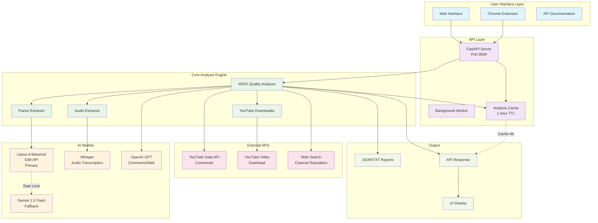
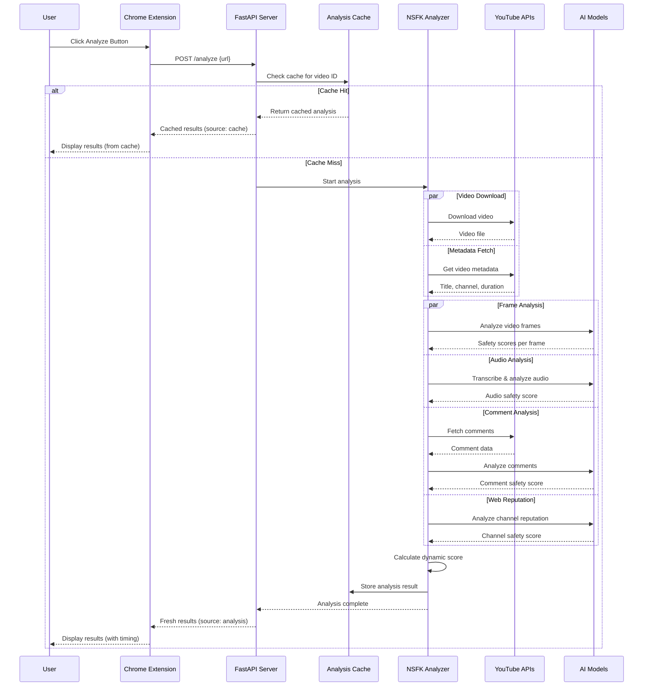
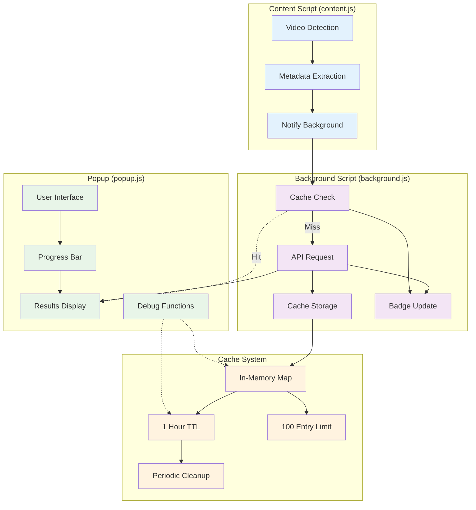
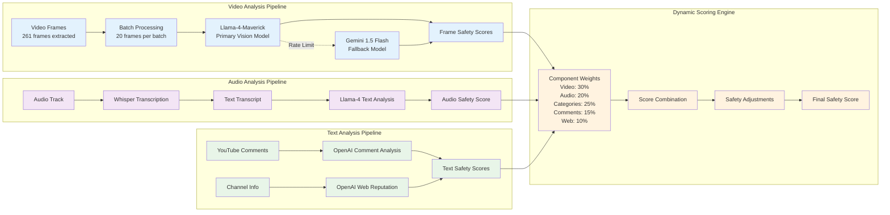
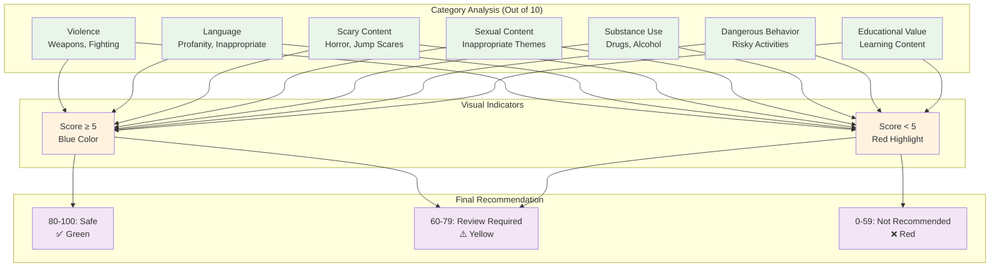
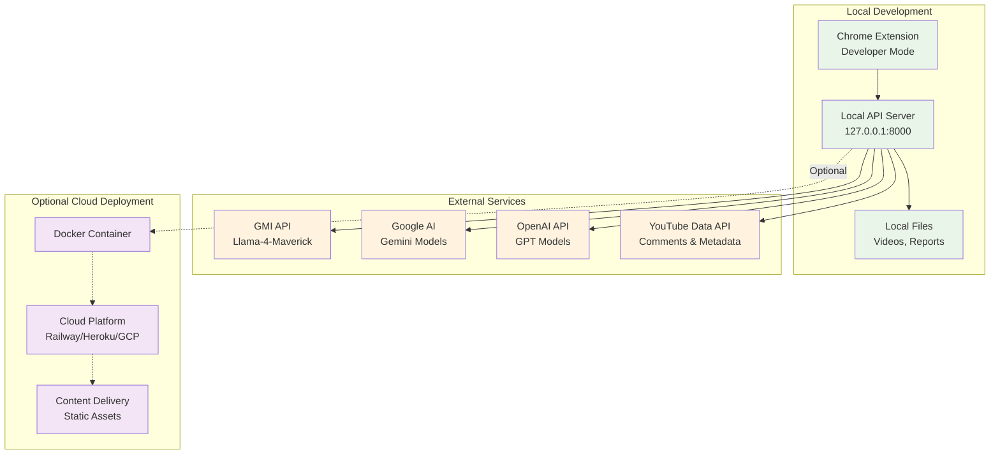

# NSFK System Architecture Flow Diagram

## 🏗️ System Overview

## 🔄 Detailed Analysis Flow

## 🎯 Chrome Extension Detailed Flow

## 🤖 AI Model Processing Flow

## 📊 Category Scoring System

## 🔧 Technical Implementation Details

### API Endpoints
- **POST /analyze** - Main analysis endpoint
- **GET /health** - Health check and status
- **GET /docs** - Interactive API documentation
- **GET /** - API information and endpoints

### Cache Implementation
- **Storage**: In-memory JavaScript Map
- **TTL**: 1 hour (3,600,000 ms)
- **Size Limit**: 100 entries (LRU eviction)
- **Cleanup**: Every 10 minutes
- **Debug**: `nsfkDebug.checkCacheStatus()`

### Error Handling
- **Retry Logic**: 2 attempts with 5-second delays
- **Fallback Models**: Gemini when Llama rate-limited
- **Timeout Handling**: 4-minute API timeout
- **Network Errors**: Graceful degradation

### Performance Optimizations
- **Concurrent Processing**: Parallel frame analysis
- **Batch Processing**: 20 frames per batch
- **Scene Detection**: Smart frame selection
- **Rate Limit Management**: Model switching
- **Caching**: Aggressive result caching

## 🚀 Deployment Architecture

## 📈 System Metrics & Monitoring

### Performance Metrics
- **Analysis Time**: 30-120 seconds per video
- **Cache Hit Rate**: ~80% for repeated videos
- **API Success Rate**: >95% with fallback models
- **Frame Processing**: 261 frames per video average
- **Batch Efficiency**: 20 frames per batch optimal

### Quality Metrics
- **Model Accuracy**: Llama-4-Maverick primary (99.6% usage)
- **Fallback Usage**: Gemini <1% (rate limit scenarios)
- **Audio Transcription**: Whisper base model
- **Comment Coverage**: YouTube Data API v3

### Resource Usage
- **Memory**: ~2GB peak during analysis
- **Storage**: Temporary video files (auto-cleanup)
- **Network**: 8MB average per video download
- **CPU**: Intensive during frame extraction

---

## 🎯 Key System Benefits

1. **Intelligent Caching** - Reduces analysis time from minutes to seconds
2. **Multi-Model Fallback** - Ensures high availability despite rate limits
3. **Real-time Feedback** - Progress tracking and visual indicators
4. **Local Processing** - Privacy-focused with local API deployment
5. **Comprehensive Analysis** - Video, audio, comments, and reputation
6. **Parent-Friendly** - Simple scoring system with clear recommendations
